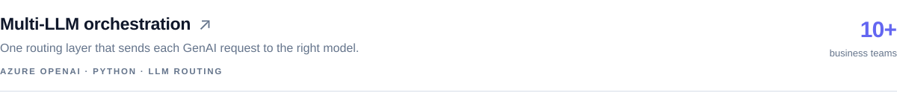
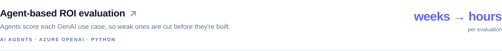
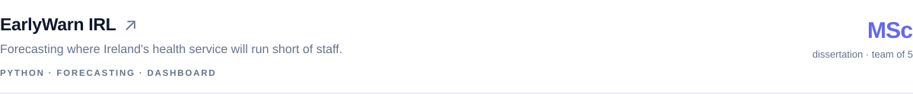
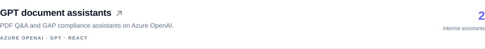
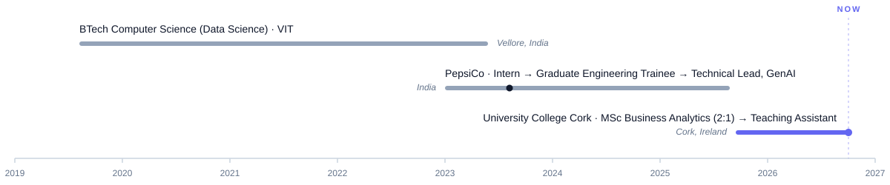
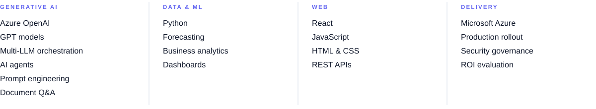

<!-- The images in assets/ are generated by build.py: edit the text there and run `python3 build.py`. -->

[Portfolio](https://vasanthkumard1248.github.io/) &nbsp;·&nbsp; [LinkedIn](https://www.linkedin.com/in/vasanthkumar-d-957376122/) &nbsp;·&nbsp; [Medium](https://medium.com/@learningsatscale) &nbsp;·&nbsp; [vasanthtjr@gmail.com](mailto:vasanthtjr@gmail.com)

 

 

Most GenAI projects die as demos. At **PepsiCo** I led GenAI delivery end to end, from the first conversation with a business team to code in production and measuring whether it paid off.

What I learnt is that shipping comes down to judgement more than engineering: knowing which use cases to turn down, and when to push back instead of building what was asked for.

 

Full case studies, told as problem → approach → build → result, on my [portfolio](https://vasanthkumard1248.github.io/#projects).

 

Recognised at PepsiCo with the **Business Impact Award** (2023) and an **H1 2025 D&amp;AI Award**.

 

 

**Teaching** &nbsp;Python for Business Analytics to MSc students at University College Cork. 
**Writing** &nbsp;[GenAI in Action](https://medium.com/@learningsatscale), a biweekly newsletter for 300+ readers on turning AI hype into production results. 
**Looking** &nbsp;for GenAI engineering, AI product and analytics roles in Cork, hybrid or remote.

 

<i>Judgement before engineering.</i>

