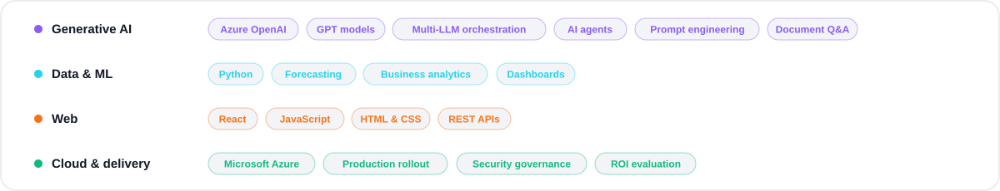
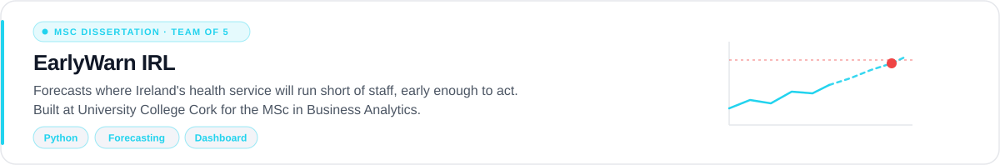
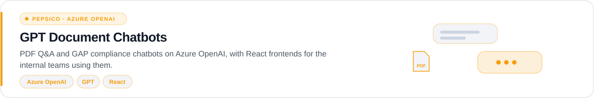

<!--
  If you're reading the raw source: hello. The images in assets/ are generated
  by build.py, so edit the text there and run `python3 build.py`.
-->

  <a href="https://vasanthkumard1248.github.io/"><b>Portfolio&nbsp;↗</b></a> &nbsp;&nbsp;·&nbsp;&nbsp;
  <a href="https://www.linkedin.com/in/vasanthkumar-d-957376122/"><b>LinkedIn&nbsp;↗</b></a> &nbsp;&nbsp;·&nbsp;&nbsp;
  <a href="https://medium.com/@learningsatscale"><b>Medium&nbsp;↗</b></a> &nbsp;&nbsp;·&nbsp;&nbsp;
  <a href="mailto:vasanthtjr@gmail.com"><b>Email&nbsp;↗</b></a>

Most GenAI projects die as demos. I spent two and a half years at **PepsiCo** making sure mine didn't: I led GenAI delivery end to end, from the first conversation with a business team to code in production and measuring whether it paid off. The clearest evidence is a multi-LLM orchestration layer that 10+ business teams went on to use.

What I learnt is that the projects that ship come down to judgement more than engineering: knowing which use cases to turn down, and when to push back instead of building what was asked for.

I've since finished an **MSc in Business Analytics at University College Cork**, where I now teach Python to MSc students. I'm looking for roles where business intent meets what the technology can actually deliver, in Cork, hybrid or remote.

Each case study, told as problem → approach → build → result, is on my <a href="https://vasanthkumard1248.github.io/#projects">portfolio ↗</a>

<table>
<tr><td>
<b>University College Cork</b> &nbsp;—&nbsp; Postgraduate Teaching Assistant &nbsp;·&nbsp; Cork, Ireland &nbsp;·&nbsp; Sep 2026 – Present 
Weekly tutorials for MSc students in Python for Business Analytics.
</td></tr>
<tr><td>
<b>PepsiCo</b> &nbsp;—&nbsp; Technical Lead, GenAI Solution Delivery &nbsp;·&nbsp; India &nbsp;·&nbsp; Aug 2023 – Aug 2025 
Promoted from Graduate Engineering Trainee. Owned GenAI solutions end to end on PepsiCo's enterprise platform. 
🏆 Business Impact Award (2023) &nbsp;·&nbsp; 🏆 H1 2025 D&amp;AI Award
</td></tr>
<tr><td>
<b>PepsiCo</b> &nbsp;—&nbsp; Data Analyst Intern &nbsp;·&nbsp; India &nbsp;·&nbsp; Jan 2023 – Jun 2023 
GPT-powered document chatbots on Azure OpenAI, plus React frontends for internal tools.
</td></tr>
</table>

🎓 <b>MSc Business Analytics</b>, University College Cork, 2:1 (2026) &nbsp;·&nbsp; <b>BTech Computer Science (Data Science)</b>, VIT (2023)

- Teaching **Python for Business Analytics** to MSc students at University College Cork.
- Writing **[GenAI in Action](https://medium.com/@learningsatscale)**, a biweekly newsletter for 300+ readers on turning AI hype into production results.
- Open to roles in **GenAI engineering · AI product · analytics**: Cork, hybrid or remote.

> *Judgement before engineering.*
>
> *Most GenAI projects don't fail in the build; they fail in the decision to build them. I'd rather turn down three weak use cases early than ship one that nobody uses.*

<!--
  Optional, like the sample's closing section. Uncomment and fill in with your own:

<b>🔍 A few things that don't fit on a résumé</b>

 

- [Something you do outside work that says how you think]
- [A habit or quirk in how you build things]
- [Something people are surprised to learn]

-->

Images generated from <code>build.py</code> · Last updated 2026

